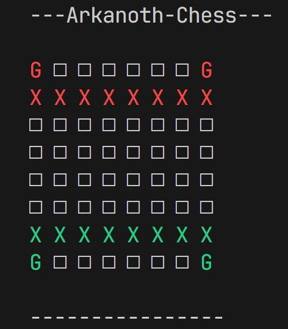
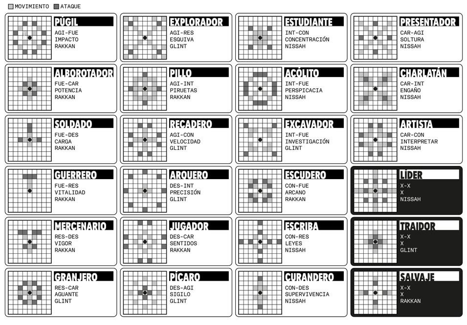

# Arkanoth Chess
## About Arkanoth Chess

Arkanoth Chess is a unique twist on the classic game of chess, featuring custom piece types and innovative gameplay mechanics. It is a command-line based game where you play against a computer opponent.

### Features
- **Custom Piece Types**: Experience new strategies with unique pieces like the Pawn (moves differently than standard chess) and the Warrior (currently implemented as a piece type but unused in standard setup).
- **Learning Opportunity**: Developed to explore and understand various design patterns such as Observer and Facade.
- **Computer Opponent**: Play against a simple AI that makes random valid moves and attacks.

### Project Structure

The project is organized as follows:

- `src/`: Contains the source code.
    - `main.py`: The entry point of the game.
    - `gameboard.py`: Manages the game board state, pieces, and event handlers.
    - `turn_mgr.py`: Controls the game loop, turn management (Player vs Computer), and win conditions.
    - `user_interaction.py`: Handles user input and command-line interaction.
    - `computer.py`: Implements the AI logic for the computer opponent.
    - `event.py`: Implements a simple event subscription system (Observer pattern).
    - `square.py`: Represents a single square on the board.
    - `pieces/`: Contains piece definitions.
        - `piece.py`: Abstract base class for all pieces.
        - `pawn.py`: Implementation of the Pawn piece.
        - `warrior.py`: Implementation of the Warrior piece.
        - `empty.py`: Represents an empty square.
    - `exceptions/`: Contains custom exception classes.

### How to Play

1.  **Run the game**: Execute the following command from the root directory:
    ```bash
    python src/main.py
    ```

2.  **The Board**: The board is displayed in the terminal.
    -   `X` represents a Pawn.
    -   `G` represents a Warrior.
    -   Green pieces are yours (Player).
    -   Red pieces are the opponent (Computer).
    -   Coordinates are standard algebraic notation (e.g., A1, B2). Columns are letters (A-H), rows are numbers (1-8).

3.  **Controls**:
    -   When it's your turn, you will be prompted to choose a piece to move. Enter the coordinate of the piece (e.g., `A1`).
    -   Then, choose where to move or attack. Enter the destination coordinate (e.g., `A2`).
    -   If the move is invalid, you will be prompted again.

4.  **Rules**:
    -   **Pawn**:
        -   Moves 1 square forward (Green moves up, Red moves down).
        -   Attacks 1 square diagonally forward.
    -   **Win Condition**: Eliminate all opponent pieces to win.

### Technical Details

This project utilizes several design patterns:
-   **Observer Pattern**: Used for event handling (`event.py`, `gameboard.py`). The gameboard subscribes to events like `piece_movement`, `piece_attack`, and `turn_start` to update the board state and display.
-   **Facade Pattern**: `TurnManager` acts as a facade, coordinating the game flow between the user, the computer, and the gameboard.

### Inspiration
This project was ideated by Quinmael and developed for fun and educational purposes.



